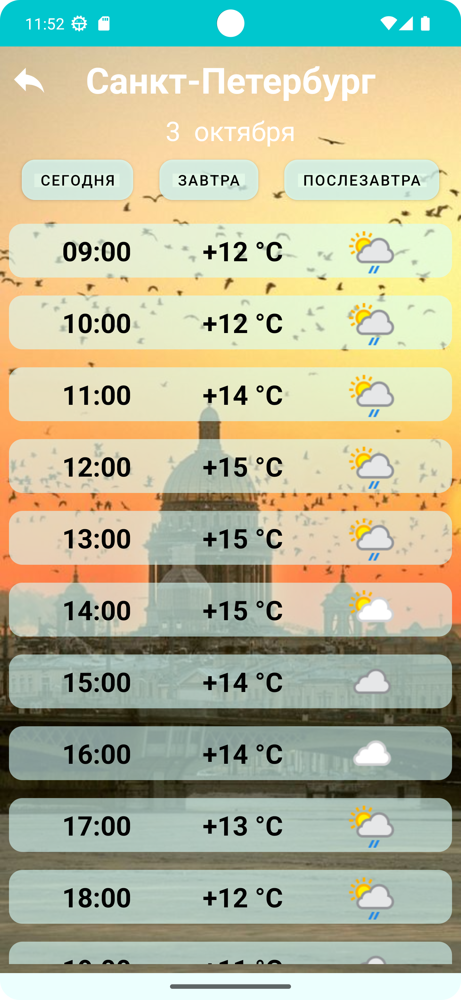

## Погода

**Реализовано:**

- короткая заставка с иконкой приложения

- выбор города из списка, отображение текущей погоды в городе, прогноз на три дня (температура,
  влажность, скорость ветра)

          

- фон, уникальный для каждого города, почасовой прогноз на три дня, возможность по клику посмотреть
  только фотографию города

            

- Использован открытый API https://www.weatherapi.com
- Библиотеки:
  Coroutines, Recyclerview, Navigation, Dagger Hilt, Retrofit, GSON, OkHttp, Glide
- Архитектура MVVM
- Весь UI в соответствии с рекомендациями Material Design

